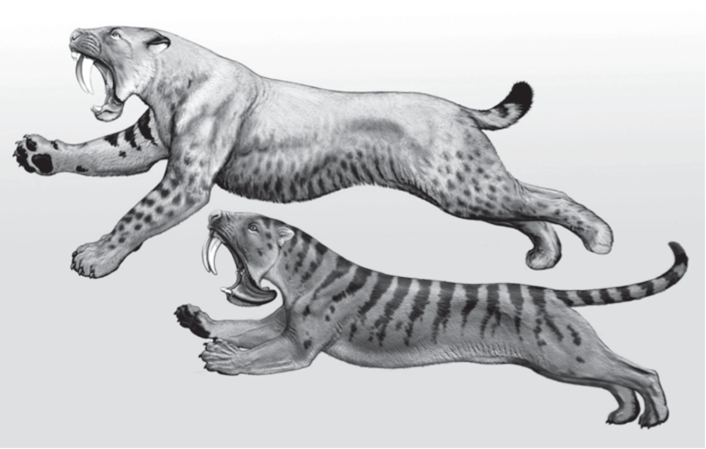

## Why a syntactician is here

Most of my work is in English syntax, but I've been writing a book on a theory from the philosophy of science called Homeostatic Property Cluster theory.

HPC theory says: a category is a cluster of properties that **keeps itself clustered**. Mechanisms push things back when they drift, and the clustering itself sustains the mechanisms. The payoff: the cluster is **projectible** — find some properties, predict others.

::: {.notes}
Stop here and make sure they have the idea before moving on. HPC theory is from philosophy of biology originally. It replaced essentialism: instead of asking "what is the essence of this category?" you ask "what mechanisms keep these properties bundled together?" The answer varies by domain. The key move: the category is real because it's projectible, not because it has an essence.
:::

## An example

{width=65% fig-align="center"}

*Smilodon* (top) and *Thylacosmilus* (bottom). 100 million years apart. No shared ancestor. Nearly identical skulls.

The properties cluster because the same functional pressures — ambush predation, hypercarnivory — reward the same body plan. In biology, the stabilizing mechanisms are things like developmental constraints, ecological niches, predator-prey dynamics.

::: {.notes}
These are two apex predators that evolved nearly identical skull architecture despite being separated by over 100 million years of mammalian evolution — Smilodon is a placental cat, Thylacosmilus is a South American marsupial. Place them side by side and you see the same animal, arrived at twice. Not because of shared essence but because of shared functional pressures producing similar solutions. The clustering is maintained by mechanisms, and the clustering sustains the mechanisms. Find the canines, predict the forelimbs. That's projectibility. Image: © Carl Buell, used with permission.
:::

## The connection to variationist work

For linguistic categories, the stabilizing mechanisms that work *across* speakers are social: convergence, accommodation, network density, gatekeeping. **That's the variationist research programme.**

But in biology, the mechanisms don't operate in a vacuum — they operate within ecological niches. The niche is the conditioning structure: it determines which mechanisms are active and what they maintain.

Register, dialect, and discourse community are the **ecological niches of language**. The mechanisms variationists study operate within them.

But register, dialect, and discourse community aren't just the niches my theory operates in. They're **categories themselves** — and HPC theory is a theory of categories. So the relationship is reciprocal: getting the variety categories right makes the linguistic categories (noun, countable, grammatical) more projectible. And applying HPC theory to variety categories should tell us something about what holds them together, where they fray, and what predicts their boundaries.

::: {.notes}
The bridge. In biology, the mechanisms are ecological and developmental. In linguistics, they're social — exactly what variationist sociolinguistics has been studying for decades. I'm here because your field has the mechanism layer my theory needs. But if varieties are the conditioning structure that makes categories projectible, I need a principled account of what varieties are. That's the question.
:::

## The grammar is conditioned

The standard move: social factors *correlate with* linguistic variation. Age predicts variant rates. Class predicts style.

HPC says something stronger: **each variable, each grammar is a category, and social context is one of the homeostatic properties in its cluster.** Pool across contexts and projectibility collapses — not because you've lost statistical power, but because you've averaged over distinct conditioning regimes.

One pooled curve isn't one grammar.

::: {.notes}
This is the ontological claim that everything else rests on. The difference between "correlates with" and "conditions" matters: a correlate can be ignored without losing structure; a conditioning variable can't. This isn't about reifying named varieties as discrete systems — it's about recognizing that the grammar is conditioned on social context the way it's conditioned on syntactic context. The conditioning structure is continuous, not categorical. The Ikea analogy, if useful: you open the hardware bag and pull out a bolt. It doesn't fit. The bag looks like a mess. But the bag has bolts for six different steps. Each step's bolts are precise. The bag isn't noisy; you failed to condition on which step you're on. Same with there's vs. there are: pool them and it looks like variable agreement. Condition on register and you find three distinct variants (Krejci & Hilton 2022), each tight. The invariant there's is a presentational particle with its own distributional profile.
:::

## What are the parameters?

The conditioning space is continuous and high-dimensional. Three cuts through it yield the most predictive lift:

| Cut | Conditions on | Stability |
|-----|--------------|-----------|
| [Situation]{.term} | Activity, setting, goals | Token-level: shifts within a conversation |
| [Ascription]{.term} | How you're classified | Speaker-level: durable, imposed |
| [Identification]{.term} | Whose norms you orient to | Trajectory-level: chosen, but sticky |

Each is internally complex — ascription bundles region, class, ethnicity, age. These aren't atomic categories. And there may be other cuts that matter for questions I'm not asking. But these aren't arbitrary analyst choices — they track where different maintenance mechanisms operate.

::: {.notes}
The book says: "The conditioning space is certainly richer than two axes, but these are the cuts that yield the most predictive lift for the questions this chapter asks." Traditional labels (register, dialect, discourse community) approximate which cut dominates in a particular analysis, but none is purely one-dimensional. People who know the three-waves literature better than I do may see a mapping here: ascription aligning roughly with first-wave demographic conditioning, identification with third-wave attention to social meaning and stance. I'd be curious whether that holds up. A note on terminology: I avoid "appropriateness" (Flores and Rosa argue the concept is inherently normative). The model-internal term is "listener expectation" or "predictive match" -- what the listener's model predicts given S/A/I, not what's normatively correct.
:::

## When dimensions diverge

The three waves of VS each foreground one of these dimensions. S/A/I holds all three as co-present parameters whose **divergence** generates predictions -- not just whose coexistence needs acknowledgment.

**S ≠ A:** The situation doesn't match the ascription baseline -- a familiar source of tension in variationist data.

**S ≠ I:** The situation demands casualness but identification pulls toward formality, or vice versa.

**A ≠ I:** How you're classified doesn't match whose norms you orient to. This is the one I want to focus on, because it unifies two literatures.

::: {.notes}
This is the key structural feature of the conditioning space. The framework's general prediction: divergence between any pair degrades projectibility and raises coordination costs for everyone in the interaction. S/A divergence is the most familiar — it's the bread and butter of stylistic variation. S/I divergence is less studied but real — the academic who can't turn off formal register at the pub, the student who can't code-switch into institutional norms. A/I divergence is the theoretically novel case because it unifies passing and raciolinguistic perception as mirror cases of the same mechanism.
:::

## Mirror cases

Passing and raciolinguistic perception are **mirror cases** of the same mechanism.

- In passing, identification overrides ascription
- In raciolinguistic perception, ascription overrides identification

Same gap, opposite directions.

The framework predicts symmetry. In practice, the symmetry breaks: ascription overrides identification far more easily than the reverse. That asymmetry is itself a prediction -- it tells us where power enters and where listener expectations become least updatable.

In Bayesian terms: ascription is a very strong prior. When it dominates, the actual linguistic signal can't shift the posterior. I experienced this in Japan -- a decade of residence, Japanese family, full competence, and wait staff would still address my wife instead of me. The listener's ascription-based expectation was so dominant that the evidence couldn't update it.

::: {.notes}
Passing is studied in one literature, raciolinguistic perception in another. S/A/I says they're the same phenomenon -- the A/I gap -- running in different directions. The asymmetry is real and important, but it's visible precisely because the framework predicts symmetry as the baseline. Without a framework that treats A and I as separable dimensions of the same conditioning structure, you can't even state the asymmetry precisely. If pushed on the symmetry framing: the framework isolates the coordination mechanism, but the conditioning space is already structured by power before any coordination game begins. Ascription is not a neutral prior -- it's a politically constituted one. The framework can represent this (through the prior on A), but it doesn't derive it endogenously, and that's a limitation worth naming. The Japan case also illustrates identification shaping production: I learned Japanese from women, so my default first-person pronoun is boku rather than ore, and I never acquired the particle sa. The same anti-hierarchy values show up in English -- I tell my students to call me "Brett." Identification can be consistent across languages even when ascription differs radically.
:::

## Where the cluster frays

Where S, A, and I converge, you get a **variety** -- a projectible cluster maintained by mechanisms. Features in the stable core aren't variable: all dimensions predict the same form.

Where they diverge, the cluster frays -- and **that's where variables live**. A feature becomes variable precisely when the conditioning dimensions pull in different directions. The envelope of variation should map onto the divergence structure of the conditioning space.

This is the same structure HPC theory finds in linguistic categories. [Furniture]{.mention} is syntactically uncountable but semantically discrete: the two dimensions of "countability" diverge, and predictions from either alone get worse.

::: {.notes}
This is a partial answer to "where's the variable?" The framework doesn't just condition on variables -- it predicts where variables should exist. They aren't randomly distributed across the grammar. They cluster at the fringes of the conditioning space, where different S/A/I configurations make different predictions. The stable core of a variety is invariant precisely because all dimensions converge. This is testable: features should be most variable where S, A, and I disagree, and most stable where they converge.

Not every divergence is variety-relevant -- idiosyncratic differences (a deep voice, long pauses) aren't maintained by social mechanisms and don't count as conditioning structure. But what counts as idiosyncratic is itself variety-relative: pitch is physiology in English but conditioning structure in Japanese, where high pitch is female-coded. The test is always: no conditioning gain, no maintenance claim.
:::

## What S/A/I adds to variationist practice

Here's what I think S/A/I makes explicit that current practice leaves implicit. Tell me if I'm wrong.

| Current practice | S/A/I |
|------------------------|-------------------|
| Variation is typically modeled as individual production | The conditioning structure is interactional -- ascription is what listeners do, identification is what speakers orient to |
| Identification and ascription are modeled in the same way | Identification is structurally different from ascription -- different stability, different agency, and their divergence generates predictions |
| Studies tend to foreground one dimension | All three are maintained by partially independent mechanisms -- divergence is structured and stable, not noise, and projectible from each dimension separately |
| Situation is modeled as having uniform effects across speakers | A/I configuration should predict the *magnitude* of situational shifting -- a testable interaction that requires separating A from I |

::: {.notes}
This is the toughest moment in the talk. Be careful: third-wave work (Eckert, Bucholtz & Hall, Silverstein, Agha) already distinguishes indexicality from demographic coding under different terminology. The claim here isn't that variationists haven't noticed these distinctions -- it's that S/A/I provides a formal unification that makes their divergence analytically productive (generating predictions, not just acknowledging complexity). If pushed: "What does S/A/I give that indexical fields and enregisterment don't?" Answer: the formal separability of the durable and the agentive, and the prediction that their divergence has a specific distributional signature.

Drummond & Schleef (2016) describe the tension: first and second wave treat identity as stable/imposed; third wave treats it as fluid/constructed. Both are real simultaneously, but neither tradition can do formal work with the gap between them. S/A/I holds both at once by making them structurally different parameters whose divergence generates testable predictions.

If discussion goes here: the relationship between the waves may parallel the relationship between syntax and semantics in linguistics more broadly. Each wave foregrounds its discovery while backgrounding the others. S/A/I says: they're co-present, and when you use one label (like "dialect") for what is really the interaction of multiple co-present dimensions, you confuse yourself at the boundaries.
:::

## What HPC adds to variationist practice

The payoff is **projectibility**: find some properties, predict others. Everything else serves that.

- **Categories are real without essences** -- because they're projectible. Varieties are real the way words are real: no necessary and sufficient conditions, but find the conditioning structure and predictions follow.
- **Boundary cases are evidence, not embarrassments.** They're where projectibility degrades, which tells us where mechanisms operate differently. The messiness is the data.
- **The reciprocity between clustering and mechanisms** is what makes categories self-sustaining. Speakers converge → norms form → divergence becomes costly → convergence reinforces. That feedback loop IS the category.
- **Weaken a stabilizer** and projectibility should degrade -- specific predictions should fail in identifiable ways.
- **No conditioning gain, no maintenance claim** -- if conditioning doesn't improve prediction, the category isn't doing epistemic work.

::: {.notes}
This is the general HPC contribution, distinct from the specific S/A/I decomposition. These follow from HPC applied to any domain. The first two are probably the most important for this audience: "real without essences" settles the philosophical question variationists live with ("are dialects real?"). "Boundary cases as evidence" reframes their hardest data from noise into signal. The mechanisms point vindicates Milroy and Eckert's stance and makes it principled. The reciprocity is what "homeostatic" means -- it's not just that mechanisms maintain clusters, but that clusters sustain mechanisms. The last two are testable predictions.
:::

## Exogenous and endogenous stabilizers

S/A/I are **exogenous** stabilizers -- they come from outside the interaction:

- Situation stabilizes because activities recur
- Ascription stabilizes because others' perceptions are durable
- Identification stabilizes because normative orientation is sticky

But there's a fourth stabilizer that's **endogenous** -- it arises from the interaction itself:

- **Coordination costs.** Once a community converges on a bundle of conventions, unilateral deviation is costly. That's what makes it an equilibrium.

S/A/I and coordination costs aren't independent layers. Ascription locks in partly *because* others coordinate on it. Coordination costs operate *through* S/A/I. But the distinction is still useful: S/A/I are the dimensions LVC already models well. Coordination costs are the endogenous dynamics that game theory makes visible.

::: {.notes}
This is a distinction from O'Connor's evolutionary game theory framework. The exogenous stabilizers are what LVC has excellent tools for: social networks, demographic categories, situational coding. The endogenous stabilizer is what game theory contributes. O'Connor (2019) shows through sim-max signalling games that stable partitions emerge under evolutionary dynamics even from bare coordination problems with no social structure at all. Two strangers on a sidewalk coordinate on which side to pass. No situation, no identity, no ascription -- just payoff from successful coordination. In real language, both layers operate simultaneously, which is why varieties are so robust. The exogenous/endogenous distinction also explains why varieties are bundles rather than independently varying features: you're coordinating on the whole package. Deviate on one feature and you've signalled you might be playing a different game.
:::

## Basins and asymmetries

O'Connor (2021) formalizes this: a variety occupies a **basin of attraction** -- the set of conditions under which the coordination dynamics pull you toward that equilibrium.

- Deeper basin = more perturbation absorbed = more stable variety
- Switching varieties means climbing over the boundary between basins

**The cultural red king effect** (O'Connor 2017): minority groups encounter outgroup members more often, so they learn to accommodate majority norms faster. Standard-variety speakers rarely need to accommodate. Non-standard speakers bear most of the coordination cost.

O'Connor (2022): even **arbitrary** social categories produce discriminatory equilibria. No historical prejudice is needed to get the dynamics started -- though history determines *which* categories become salient.

::: {.notes}
The basin-of-attraction language is from O'Connor's "Measuring Conventionality" (2021), where she uses Shannon entropy over basins to measure degrees of conventionality. The cultural red king effect is directly relevant to standardization: it predicts an asymmetric coordination cost that your audience will immediately recognize from their own data. The "arbitrary tags" result is from the "Why Natural Social Contracts are Not Fair" paper (2022) and the Origins of Unfairness book (2019): in her models, populations with two groups playing the Nash demand game consistently evolve to discriminatory equilibria where one group demands High and the other accommodates with Low. The groups can be "green bellies" and "yellow bellies" -- no prior asymmetry needed. The dynamics alone are sufficient. This is a stronger claim than "history created prejudice and coordination maintains it." It says the coordination dynamics themselves generate inequity whenever social categories exist. History determines which categories, but the inequity is endogenous.
:::

## Corroboration: Belfast

**Belfast** (Milroy 1987): Dense, multiplex social networks maintained local dialect features. Networks dissolved (deindustrialization, housing policy). Dialect levelling followed.

**LVC reads this as:** network structure maintains dialect.

**HPC reads this as:** both stabilizer types failed together. The exogenous stabilizer (network density) was dissolved by external forces. But that also shifted the endogenous stabilizer: speakers now encountered more outgroup members, so coordination costs flipped -- accommodating to the majority variety became the better-paying strategy. The cultural red king in reverse. Both layers degraded simultaneously, which is why the levelling was so rapid. The prediction: projectibility of the local variety should degrade fastest for features with the highest coordination costs.

::: {.notes}
Belfast is an exogenous stabilizer story: the social networks were dissolved by external forces -- specifically, deindustrialization and housing policy in a context of sectarian conflict, not impersonal forces. But the coordination cost story adds a layer: when network density drops, coordination payoffs shift too. More outgroup encounters means accommodation pressure increases (the cultural red king in reverse). Both layers degrade simultaneously, which is why the levelling was so rapid. The prediction about feature ordering (highest coordination costs = last to level) is testable against Milroy's existing data: phonological variables with high interactional stakes should be more resistant than those that are purely indexical.
:::

## The origins of unfairness

A listener hears a non-standard form and something shifts -- in expectations, evaluation, behaviour.

When everyone makes similar judgments, they become **coordination signals**. "Standard" vs "non-standard" occupies a deep basin of attraction: self-sustaining, hard to exit unilaterally.

The exogenous stabilizers (ascription categories, institutional gatekeeping) and the endogenous one (coordination costs) reinforce each other. The cultural red king means non-standard speakers bear most of the accommodation cost. The result: a stable, systematically unfair equilibrium -- not because of prejudice, but because unilateral deviation doesn't pay.

::: {.notes}
I'm not telling you that standardization is unjust -- you know that better than I do. What I'm offering is a formal account of why it's self-sustaining. The new vocabulary helps: the standard variety occupies a deep basin of attraction. Non-standard speakers face asymmetric coordination costs (cultural red king). The exogenous stabilizers (ascription categories produced by history, institutional gatekeeping) and the endogenous one (coordination payoffs) lock each other in. Employers coordinate on using "standard" speech as a hiring filter -- not because any individual employer decided to discriminate, but because everyone expects everyone else to use this signal. Even an employer who knows the linguistic facts faces pressure to conform. O'Connor's models show this emerges from arbitrary categories -- history determines which categories become salient, but the dynamics would produce inequity from any salient partition. What the framework contributes is the diagnosis: this is a coordination equilibrium maintained by both exogenous and endogenous stabilizers. Attitude change alone doesn't shift it because it addresses neither. What would shift it is your domain, not mine.
:::

## The operationalization challenge

**Is this circular?** Identification shapes production, production signals identification. But that's not a vicious circle -- it's the homeostatic feedback loop the framework predicts. As long as you let time into the model, reciprocal causation is a feature, not a bug.

**The real challenge is coordination costs.** S/A/I are things sociolinguists already know how to measure. But how do we observe the endogenous stabilizer? Some candidates:

- **Accommodation speed** — higher coordination costs should predict faster adjustment
- **Constraint in high-stakes vs low-stakes contexts** — features should be tighter where miscommunication is costly
- **Levelling rates after network disruption** — how fast does the category degrade when a stabilizer is weakened?

::: {.notes}
Two moves on this slide. First, dissolve the circularity worry. Pearl's causal framework handles reciprocal causation through temporal ordering -- cause precedes effect, so A→B→A' is fine as long as A' is a later time-slice. The reciprocity between identification and production is exactly what "homeostatic" means -- it's the category maintaining itself. Second, pose the real methodological challenge. LVC has excellent tools for S/A/I -- matched guise, ethnography, situational coding. What I'm bringing isn't better ways to measure those. It's the framework that makes them commensurable. But coordination costs are genuinely new as an object of measurement. The three candidates are all things LVC could measure with existing methods. Accommodation speed is measurable in conversation analysis. High-stakes vs low-stakes contrasts are available in corpus data. Levelling rates after disruption are exactly what the Belfast literature provides. O'Connor's entropy measure is another possibility -- Shannon entropy over variant distributions across communities measures how conventional a feature is. The audience can evaluate whether these are feasible in their work.
:::

## Discussion {.center}

HPC theory says varieties are the conditioning structure that makes categories projectible.

Does the S/A/I distinction help with phenomena in variationist research?

Where does it break?

What predictions does it make about your data that alternative frameworks don't?

::: {.notes}
Three provocations. First: is this useful, or just relabelling? Second: where does it fail? Third: if someone can show me a case where the framework makes the same predictions as existing accounts, it's not earning its keep. I want to know where it generates novel expectations -- and especially where those expectations might be wrong. Anticipate two objections: (1) "Where's the variable?" -- this is all framework, no empirical demonstration. Fair. The next step is to take a specific variable and show that S/A/I conditioning outperforms pooled or single-dimension models. (2) "This looks static" -- the framework handles change (anchor shifts, basin transitions, coordination cost changes after network disruption) but the talk focuses on stability. Change is the next chapter.
:::

## Backup: formal notation {visibility="hidden"}

The joint distribution over forms, conditioned on all three anchors:

$$Y \mid S{=}s,\, A{=}a,\, I{=}i \;\sim\; \text{Categorical}(\theta_{s,a,i})$$

Marginalize over A and I to recover register variation. Marginalize over S and I to recover dialect variation. The three "variety types" are slices of one joint distribution.

::: {.notes}
Backup slide for anyone who wants the formal notation. The key point is that the three dimensions interact -- you need the joint distribution, not three independent marginals.
:::
